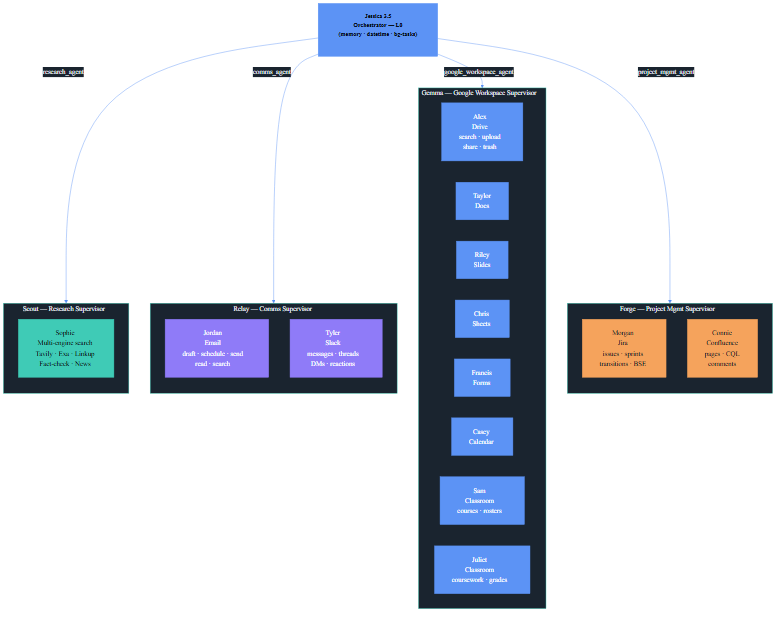
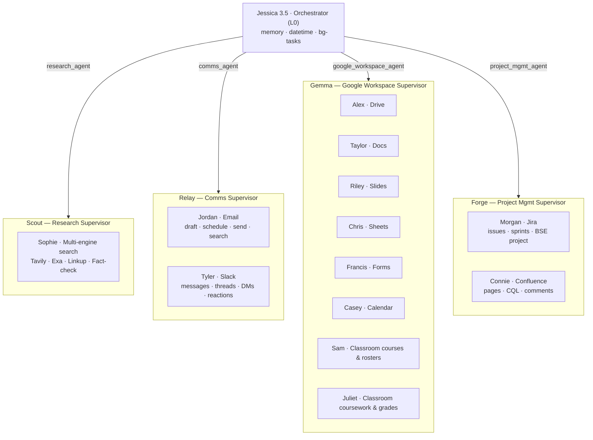
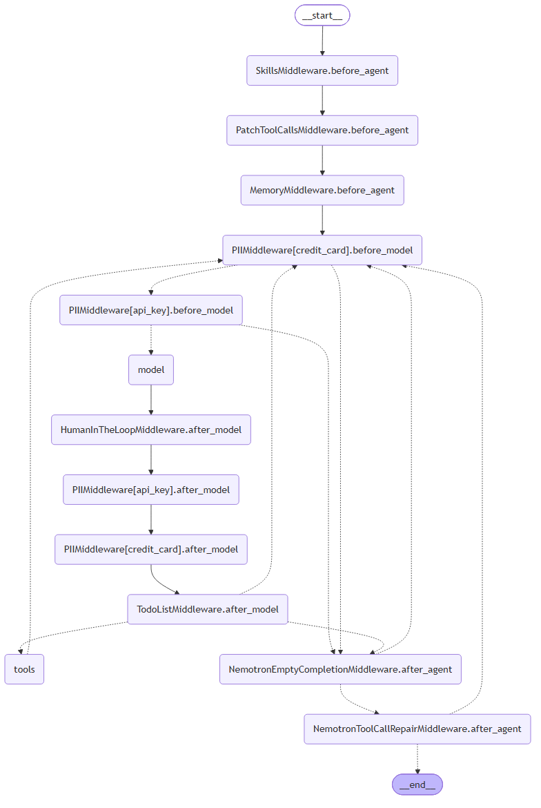

# Jessica 3.5 — Enterprise Fleet Supervisor Architecture

> **Supervisor-of-Supervisors** · LangGraph + DeepAgents · NVIDIA Nemotron-3

---

## Fleet Overview

Jessica 3.5 is a three-tier agent hierarchy:

| Tier | Role | Count |
|------|------|-------|
| **L0** | Jessica — Executive Orchestrator | 1 |
| **L1** | Domain Supervisors (Scout · Relay · Gemma · Forge) | 4 |
| **L2** | Specialist Leaf Agents (personas) | 13 |

---

## Full Team Diagram (L0 → L1 → L2)





---

## Runtime Middleware Pipeline (Compiled LangGraph)

This is the actual compiled graph topology — extracted live from the running runtime via `print_mermaid_graph.py`.



The middleware chain (left to right in execution order):

```
__start__
  → SkillsMiddleware.before_agent
  → PatchToolCallsMiddleware.before_agent
  → MemoryMiddleware.before_agent
  → PIIMiddleware[credit_card].before_model
  → PIIMiddleware[api_key].before_model
  → model  ←──────────────────────────────────┐
  → HumanInTheLoopMiddleware.after_model       │
  → PIIMiddleware[api_key].after_model         │
  → PIIMiddleware[credit_card].after_model     │
  → TodoListMiddleware.after_model             │  (conditional)
      ├─ tools ──────────────────────────────→ ┘
      └─ NemotronEmptyCompletionMiddleware.after_agent
             └─ NemotronToolCallRepairMiddleware.after_agent
                    └─ __end__
```

---

## Domain Supervisors

### Scout — Research (`research_agent`)
- **Persona**: Sophie
- **Module**: `agents.research.agent:make_graph`
- **Capabilities**: Tavily real-time search, Exa academic/technical depth, Linkup structured citations, news, live data, fact verification, temporal grounding

### Relay — Communications (`comms_agent`)
- **Persona**: Relay (supervisor) → Jordan (Email) + Tyler (Slack)
- **Module**: `agents.comms.relay:create_comms_agent`
- **Capabilities**: Email draft/schedule/send/read/search, Slack messages/threads/DMs/channels/reactions

### Gemma — Google Workspace (`google_workspace_agent`)
- **Persona**: Gemma (supervisor) → 8 leaf agents
- **Module**: `agents.google_workspace.gemma:create_gemma_agent`
- **Leaf agents**:
  | Persona | Service |
  |---------|---------|
  | Alex | Drive — search, upload, move, share, trash |
  | Taylor | Docs |
  | Riley | Slides |
  | Chris | Sheets |
  | Francis | Forms |
  | Casey | Calendar |
  | Sam | Classroom courses & rosters |
  | Juliet | Classroom coursework & grading |

### Forge — Project Management (`project_mgmt_agent`)
- **Persona**: Forge (supervisor) → Morgan (Jira) + Connie (Confluence)
- **Module**: `agents.project_mgmt.forge:create_pm_agent`
- **Capabilities**: Jira issues/sprints/transitions/comments (default project: BSE), Confluence pages/CQL/comments

---

## Anti-Drift Harness (Nemotron-3)

Registered at boot in `JESSICA3.5.py` via `nemotron_harness.attach_to_deepagents()`:

| Guard | Purpose |
|-------|---------|
| `NemotronEmptyCompletionMiddleware` | Retries when model returns empty content + no tool call |
| `NemotronToolCallRepairMiddleware` | Fixes tool calls emitted as raw JSON in `content` field |
| `PIIMiddleware[credit_card/api_key]` | Masks sensitive data before model and after model |
| `TodoListMiddleware` | Enforces scratchpad planning before multi-step execution |
| `HumanInTheLoopMiddleware` | Pauses on high-risk/irreversible tool calls for approval |
| `MemoryMiddleware` | Injects user-facts and diary context into agent state |

---

## Regenerating the Diagrams

```bash
# Full team (L0→L1→L2) — fast, no model init
python generate_full_team_diagram.py

# Runtime middleware pipeline — requires full Jessica init (~2 min)
python print_mermaid_graph.py

# Fix + render an existing .mmd file
python fix_mermaid_and_render.py
```

---

## Stack

| Layer | Technology |
|-------|------------|
| Orchestration | LangGraph + DeepAgents |
| LLM | NVIDIA Nemotron-3 Super 120B / Ultra 550B |
| Routing model | StepFun Step-3.7-Flash |
| Backend API | FastAPI |
| Frontend | Next.js 14 (App Router) |
| Auth | NextAuth.js (Google OAuth) |
| Memory | LangMem (user-facts + diary) |
| Tracing | LangSmith (`jessica-production` project) |
